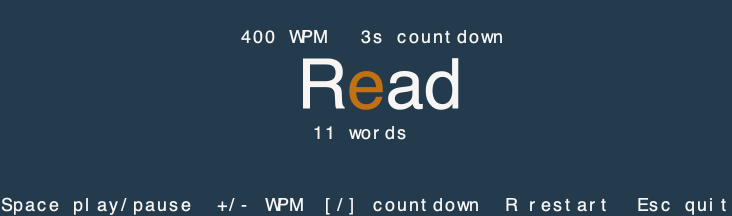

# Herdr Pace

**Your agent writes fast. Read at your own pace.**

Herdr Pace turns a completed AI reply into a small, centered speed reader. Open it when you are ready, press Space, and follow one word at a time.



- **Settle in first.** The reader opens paused. Choose a countdown from zero to ten seconds.
- **Find your rhythm.** Adjust reading speed while you read. Your speed and countdown are remembered.
- **Keep your place.** A centered focus letter, distinct paragraph and line-break cues, and controls that stay still.
- **Stay in your terminal.** Large, sharp text follows your terminal colors. Everything runs locally.

## Get started

You need macOS or Linux, [Nix with flakes](https://nixos.org/download/), and a Herdr build supporting plugin popups and popup graphics. For large text, use a terminal with [Kitty graphics](https://sw.kovidgoyal.net/kitty/graphics-protocol/) and keep Herdr's `terminal.kitty_graphics` enabled. Herdr forks can differ even when their version numbers match.

```sh
herdr plugin install Castrozan/herdr-pace
herdr plugin action invoke castrozan.pace.install-hooks
```

The second command adds capture hooks to existing Claude Code and Codex configurations. It preserves other settings and creates a backup. **Restart your AI session after installing the hooks.** If your configuration is managed by Nix or another tool, [declare the hook at its source](docs/integration.md) instead.

Add this example shortcut to Herdr's `config.toml`. Choose another key if you already use `prefix+f`:

```toml
[[keys.command]]
key = "prefix+f"
type = "plugin_action"
command = "castrozan.pace.read"
description = "open Herdr Pace"
```

Run `herdr server reload-config`. Let your AI finish a reply, then press **Ctrl+B**, release, and press **F** in that pane. Press **Space** to start reading.

You can also open it with `herdr plugin action invoke castrozan.pace.read`.

## Make it yours

| Key         | Action                         |
| ----------- | ------------------------------ |
| Space or P  | Play, pause, or replay         |
| + or -      | Adjust speed by 50 WPM         |
| [ or ]      | Adjust countdown by one second |
| R           | Restart the reply              |
| Q or Escape | Close                          |

Start at 400 WPM and a three-second countdown, then find a comfortable pace. Paragraphs use **¶**, explicit line breaks use **↵**, and both pauses scale with your reading speed. The last word stays visible when you finish.

Pace reads the latest completed reply from the current pane. It keeps the words, removes Markdown formatting, and preserves document boundaries. It does not ask another model to summarize your answer.

[Reading details](docs/reading.md) · [Capture and managed configuration](docs/integration.md) · [Development and design](docs/development.md)

## Coming from Herdr Speed Reader?

Install Herdr Pace, update your shortcut to `castrozan.pace.read`, and rerun the hook installer if you used it before. Your saved speed, countdown, and replies are carried over automatically. Once the new plugin is installed, remove the old registration:

```sh
herdr plugin unlink castrozan.speed-read
```

The old saved files are retained. Configuration managed elsewhere should update its executable to `herdr-pace capture`.
